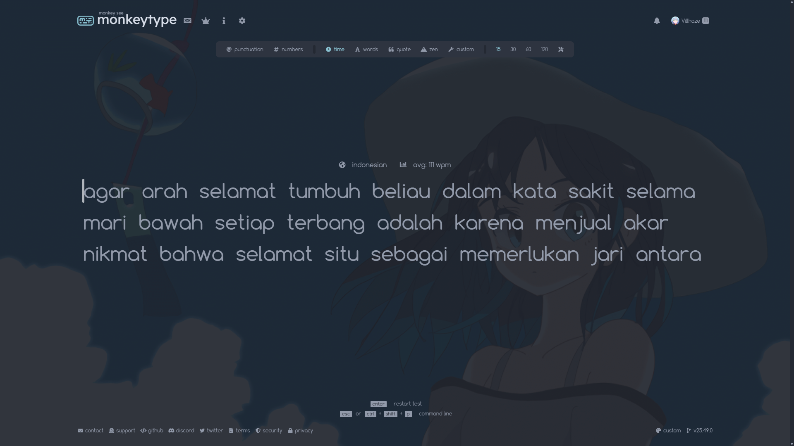
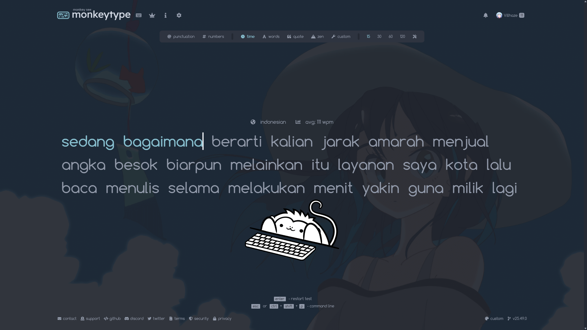

<h1 align="center">🐒 Monkeytype Custom Settings</h1>

<p align="center">
  <i>Personal configuration for my Monkeytype typing setup.</i>
</p>

---

## 🖼️ Preview



---


You can import these settings directly into Monkeytype using the guide below.

---

## 🚀 How to Apply My Monkeytype Settings

### **1. Open Monkeytype**
Visit  
👉 https://monkeytype.com

---

### **2. Open the Settings Menu**
Click the **⚙️ Settings icon** on the left sidebar.
Or you can press `esc`

---

### **3. Scroll Down to “Import / Export Settings”**
You will find a text box labeled:  
**Import or export the settings as JSON.** in **danger zone tab**

---

### **4. Copy & Paste the Settings to Import bar**
Paste the settings below into the import box, then press **Enter**.

> Replace the code below with your Monkeytype JSON settings:
```md
{
    "theme": "nord",
    "themeLight": "serika",
    "themeDark": "serika_dark",
    "autoSwitchTheme": false,
    "customTheme": true,
    "customThemeColors": [
        "#242933",
        "#88c0d0",
        "#eceff4",
        "#929aaa",
        "#2e3440",
        "#d8dee9",
        "#bf616a",
        "#793e44",
        "#bf616a",
        "#793e44"
    ],
    "favThemes": [
        "serika_dark",
        "trance",
        "rgb",
        "mint",
        "catppuccin",
        "nord"
    ],
    "showKeyTips": true,
    "smoothCaret": "medium",
    "codeUnindentOnBackspace": false,
    "quickRestart": "enter",
    "punctuation": false,
    "numbers": false,
    "words": 10,
    "time": 15,
    "mode": "time",
    "quoteLength": [
        0
    ],
    "language": "indonesian",
    "fontSize": 3,
    "freedomMode": true,
    "difficulty": "normal",
    "blindMode": false,
    "quickEnd": false,
    "caretStyle": "default",
    "paceCaretStyle": "default",
    "flipTestColors": false,
    "layout": "default",
    "funbox": [],
    "confidenceMode": "off",
    "indicateTypos": "off",
    "compositionDisplay": "replace",
    "timerStyle": "bar",
    "liveSpeedStyle": "off",
    "liveAccStyle": "off",
    "liveBurstStyle": "off",
    "colorfulMode": true,
    "randomTheme": "off",
    "timerColor": "main",
    "timerOpacity": "1",
    "stopOnError": "off",
    "showAllLines": false,
    "keymapMode": "off",
    "keymapStyle": "staggered",
    "keymapLegendStyle": "lowercase",
    "keymapLayout": "japanese_hiragana",
    "keymapShowTopRow": "layout",
    "keymapSize": 1.3,
    "fontFamily": "Comfortaa",
    "smoothLineScroll": false,
    "alwaysShowDecimalPlaces": false,
    "alwaysShowWordsHistory": false,
    "singleListCommandLine": "on",
    "capsLockWarning": true,
    "playSoundOnError": "1",
    "playSoundOnClick": "4",
    "soundVolume": 0.5,
    "startGraphsAtZero": true,
    "showOutOfFocusWarning": false,
    "paceCaret": "off",
    "paceCaretCustomSpeed": 100,
    "repeatedPace": true,
    "accountChart": [
        "on",
        "on",
        "on",
        "on"
    ],
    "minWpm": "off",
    "minWpmCustomSpeed": 100,
    "highlightMode": "letter",
    "typingSpeedUnit": "wpm",
    "ads": "result",
    "hideExtraLetters": false,
    "strictSpace": false,
    "minAcc": "off",
    "minAccCustom": 90,
    "monkey": true,
    "repeatQuotes": "off",
    "oppositeShiftMode": "off",
    "customBackground": "https://raw.githubusercontent.com/Villhazex/My-Monkeytype-Settings/refs/heads/main/background.gif",
    "customBackgroundSize": "cover",
    "customBackgroundFilter": [
        0,
        0.4,
        1,
        0.2
    ],
    "customLayoutfluid": [
        "qwerty",
        "dvorak",
        "colemak"
    ],
    "customPolyglot": [
        "english",
        "spanish",
        "french",
        "german"
    ],
    "monkeyPowerLevel": "off",
    "minBurst": "off",
    "minBurstCustomSpeed": 100,
    "burstHeatmap": false,
    "britishEnglish": false,
    "lazyMode": false,
    "showAverage": "speed",
    "showPb": false,
    "tapeMode": "off",
    "tapeMargin": 50,
    "maxLineWidth": 0,
    "playTimeWarning": "off"
}
```
